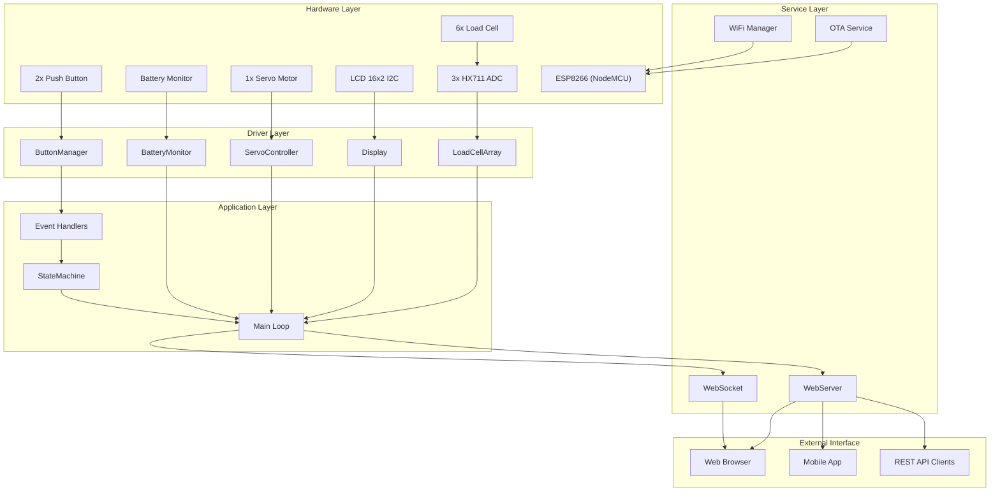
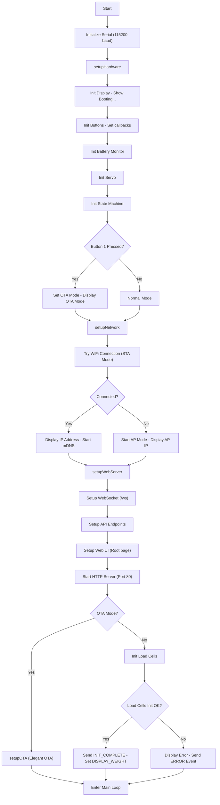
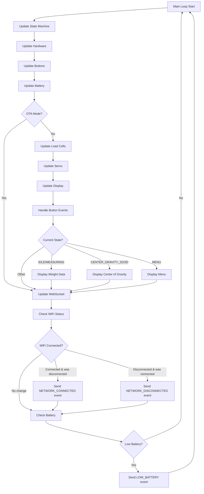
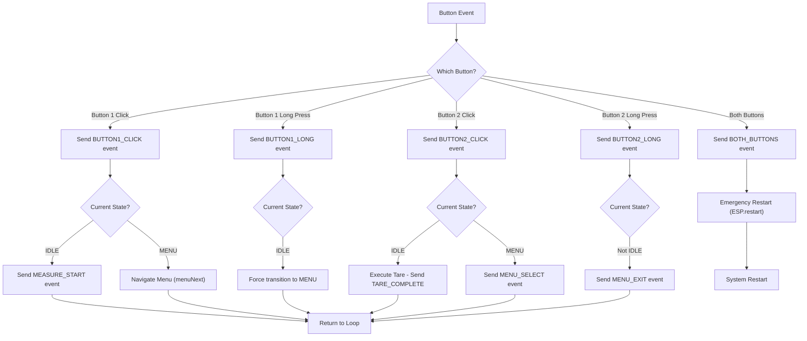
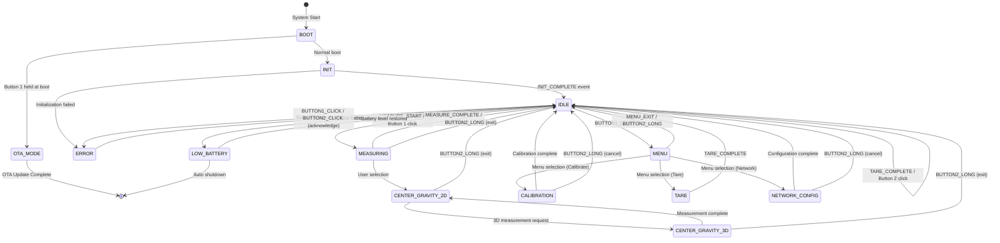

# Smart Weight Scale - Cân Thông Minh Đo Trọng Tâm

## Giới thiệu

Dự án thiết kế và xây dựng thiết bị cân thông minh có khả năng:
- Đo trọng lượng chính xác với 6 cảm biến load cell
- Tính toán trọng tâm 2D và 3D
- Hiển thị thông tin qua LCD và Web interface
- Cập nhật firmware OTA (Over-The-Air)

## Tính năng chính

### 1. Đo lường
- **Trọng lượng**: Tổng hợp từ 6 cảm biến load cell
- **Trọng tâm 2D**: Tính toán vị trí X, Y trên mặt phẳng
- **Trọng tâm 3D**: Sử dụng servo để nghiêng và tính toán độ cao Z
- **Hiệu chuẩn**: Tự động lưu và khôi phục từ EEPROM

### 2. Giao diện
- **LCD 16x2**: Hiển thị trọng lượng, trọng tâm, menu
- **Web Interface**: Theo dõi real-time qua WebSocket
- **API RESTful**: Tích hợp với các hệ thống khác

### 3. Điều khiển
- **2 nút bấm**: Đa chức năng (click, double-click, long press)
- **Menu hệ thống**: Điều hướng các chức năng
- **Chế độ OTA**: Cập nhật firmware qua WiFi

## Kiến trúc Hệ thống

### Sơ đồ Tổng quan



## Trình tự Hoạt động Chi tiết

### 1. Quy trình Khởi động (Setup Flow)



#### Chi tiết các bước khởi động:

1. **Khởi tạo Serial**: Baud rate 115200 cho debug
2. **setupHardware()**: 
   - Khởi tạo LCD và hiển thị "Booting..."
   - Cấu hình 2 nút bấm với callback functions
   - Khởi động battery monitor
   - Khởi tạo servo ở vị trí trung tâm
   - Khởi động state machine ở trạng thái BOOT

3. **Kiểm tra chế độ OTA**: Nếu Button 1 được giữ lúc khởi động
4. **setupNetwork()**:
   - Thử kết nối WiFi với credentials đã lưu
   - Nếu thành công: Hiển thị IP, bật mDNS
   - Nếu thất bại: Chuyển sang AP mode

5. **setupWebServer()**:
   - Cấu hình WebSocket endpoint `/ws`
   - Thiết lập các API: `/api/weight`, `/api/center`, `/api/battery`, etc.
   - Tạo trang web đơn giản cho monitoring
   - Khởi động HTTP server trên port 80

6. **Khởi tạo Load Cells** (nếu không phải OTA mode):
   - Khởi tạo 3 HX711 với 6 load cell
   - Load calibration từ EEPROM
   - Kiểm tra kết nối và tính ổn định

### 2. Vòng lặp chính (Main Loop)



#### Chi tiết vòng lặp chính:

1. **Update State Machine**: Xử lý events và state transitions
2. **Update Hardware**: 
   - Đọc trạng thái buttons (debouncing, multi-click detection)
   - Đo điện áp pin (moving average filter)
   - Đọc 6 load cell (non-blocking)
   - Cập nhật vị trí servo (smooth movement)
   - Refresh LCD display (rate limited)

3. **Display Logic**: Dựa trên state hiện tại:
   - **IDLE/MEASURING**: Hiển thị tổng trọng lượng + status các cell
   - **CENTER_GRAVITY**: Hiển thị tọa độ X, Y (và Z nếu 3D)
   - **MENU**: Hiển thị menu items và navigation

4. **WebSocket Updates**: Gửi real-time data tới web clients
5. **Network Monitoring**: Tự động reconnect WiFi nếu mất kết nối
6. **Battery Management**: Cảnh báo pin yếu

### 3. Xử lý Sự kiện Nút bấm



#### Chức năng nút bấm chi tiết:

**Button 1 (Primary):**
- **Single Click**: 
  - Ở IDLE: Bắt đầu đo lường
  - Ở MENU: Chuyển đến item tiếp theo
- **Long Press**: Vào menu hệ thống
- **Double Click**: Chuyển chế độ hiển thị (weight ↔ center of gravity)

**Button 2 (Secondary):**
- **Single Click**:
  - Ở IDLE: Thực hiện Tare (zero offset)
  - Ở MENU: Chọn menu item hiện tại
- **Long Press**: Thoát khỏi menu/chế độ hiện tại
- **Double Click**: Hiển thị thông tin hệ thống

**Both Buttons**: Emergency restart

### 4. State Machine



#### Mô tả các trạng thái:

- **BOOT**: Khởi động hệ thống
- **OTA_MODE**: Chế độ cập nhật firmware
- **INIT**: Khởi tạo phần cứng
- **IDLE**: Trạng thái chờ, hiển thị trọng lượng
- **MEASURING**: Đang đo lường chính xác
- **CENTER_GRAVITY_2D**: Hiển thị trọng tâm 2D
- **CENTER_GRAVITY_3D**: Đo trọng tâm 3D (với servo)
- **MENU**: Hiển thị menu hệ thống
- **CALIBRATION**: Hiệu chuẩn cảm biến
- **TARE**: Thực hiện cân bằng không
- **NETWORK_CONFIG**: Cấu hình WiFi
- **ERROR**: Trạng thái lỗi
- **LOW_BATTERY**: Cảnh báo pin yếu

## Phần cứng

### Linh kiện chính
- **MCU**: ESP8266 (NodeMCU v2)
- **Cảm biến**: 6x Load cell + 3x HX711 (dual channel)
- **Hiển thị**: LCD 16x2 I2C
- **Cơ khí**: 1x Servo (cho đo 3D)
- **Nguồn**: Pin Li-ion với mạch giám sát điện áp

### Sơ đồ kết nối
```
ESP8266 GPIO    Thiết bị
D6 (GPIO12) --> HX711_1 DOUT
D7 (GPIO13) --> HX711_1 SCK
D5 (GPIO14) --> HX711_2 DOUT
D2 (GPIO4)  --> HX711_2 SCK
D1 (GPIO5)  --> HX711_3 DOUT
D0 (GPIO16) --> HX711_3 SCK
D4 (GPIO2)  --> LCD SDA (I2C)
D3 (GPIO0)  --> LCD SCL (I2C)
D8 (GPIO15) --> Button 1
RX (GPIO3)  --> Button 2
TX (GPIO1)  --> Servo
A0         --> Battery voltage (với voltage divider)
```

## Phần mềm

### Cấu trúc thư mục
```
src/
├── main.cpp           # Chương trình chính
├── config/            # File cấu hình
│   ├── PinConfig.h
│   ├── SystemConfig.h
│   └── WebConfig.h
├── drivers/           # Driver phần cứng
│   ├── LoadCellArray.*
│   ├── Display.*
│   ├── ButtonManager.*
│   ├── ServoController.*
│   └── BatteryMonitor.*
├── services/          # Dịch vụ hệ thống
│   └── ...
├── app/              # Logic ứng dụng
│   └── StateMachine.*
└── utils/            # Tiện ích
    └── ...
```

## Cài đặt và Sử dụng

### 1. Yêu cầu
- PlatformIO IDE (VSCode extension recommended)
- ESP8266 board package
- Các thư viện (tự động cài qua PlatformIO):
  - HX711_ADC
  - LiquidCrystal_I2C
  - ESPAsyncWebServer
  - AsyncElegantOTA
  - ArduinoJson

### 2. Cấu hình
1. Sửa WiFi credentials trong `src/config/WebConfig.h`
2. Điều chỉnh vị trí cảm biến trong `src/config/SystemConfig.h`
3. Kiểm tra pin configuration trong `src/config/PinConfig.h`

### 3. Biên dịch và nạp
```bash
# Build
pio run

# Upload qua USB
pio run --target upload

# Upload OTA (sau lần đầu)
pio run --target upload --upload-port smartscale.local
```

### 4. Sử dụng

#### Khởi động thường:
1. Bật nguồn → Hệ thống tự động kết nối WiFi
2. LCD hiển thị trọng lượng
3. Truy cập web: http://smartscale.local

#### Chế độ OTA:
1. Giữ Button 1 khi khởi động
2. Kết nối WiFi AP: "SmartScale_AP" 
3. Truy cập: http://192.168.4.1/update
4. Upload file firmware.bin

#### Điều khiển nút bấm:
- **Button 1**: Click = Đo | Long = Menu
- **Button 2**: Click = Tare | Long = Thoát
- **Both**: Khởi động lại

## API Endpoints

| Method | Endpoint | Mô tả |
|--------|----------|-------|
| GET | /api/weight | Lấy trọng lượng hiện tại |
| GET | /api/center | Lấy tọa độ trọng tâm |
| GET | /api/battery | Trạng thái pin |
| POST | /api/tare | Thực hiện tare |
| POST | /api/calibrate | Bắt đầu hiệu chuẩn |
| POST | /api/restart | Khởi động lại |

## WebSocket

Kết nối: `ws://smartscale.local/ws`

Dữ liệu (JSON):
```json
{
  "weight": 1234.5,
  "battery": 85,
  "centerX": 10.2,
  "centerY": -5.8
}
```

## Thuật toán Tính Toán

### Trọng tâm 2D
```
X = Σ(Wi × Xi) / ΣWi
Y = Σ(Wi × Yi) / ΣWi

Trong đó:
- Wi: Trọng lượng tại cảm biến i
- Xi, Yi: Tọa độ cảm biến i (mm)
```

### Vị trí 6 cảm biến (bố trí hình tròn, bán kính 150mm):
- LoadCell 0: 0° → (150, 0)
- LoadCell 1: 60° → (75, 129.9)
- LoadCell 2: 120° → (-75, 129.9)
- LoadCell 3: 180° → (-150, 0)
- LoadCell 4: 240° → (-75, -129.9)
- LoadCell 5: 300° → (75, -129.9)

### Trọng tâm 3D
1. Đo ở vị trí nằm ngang → Tính X₀, Y₀
2. Nghiêng cân α° bằng servo → Đo lại → Tính X₁, Y₁
3. Tính Z: `Z = (X₁ - X₀) / tan(α)`

## Hiệu chuẩn

### Quy trình tự động:
1. Vào menu Calibration
2. Đặt cân về 0 → Nhấn Tare
3. Đặt quả cân chuẩn lên từng vị trí
4. Nhập khối lượng chuẩn
5. Hệ thống tự động tính toán và lưu vào EEPROM

### Hiệu chuẩn thủ công qua Web API:
```bash
# Tare all cells
curl -X POST http://smartscale.local/api/tare

# Calibrate specific cell
curl -X POST http://smartscale.local/api/calibrate \
  -d '{"cell": 0, "weight": 1000}' \
  -H "Content-Type: application/json"
```

## Khắc phục sự cố

| Vấn đề | Triệu chứng | Giải pháp |
|--------|-------------|-----------|
| Không kết nối WiFi | LCD hiển thị AP mode | Kiểm tra SSID/Password, reset về AP mode |
| Load cell không ổn định | Số liệu nhảy liên tục | Kiểm tra kết nối, thực hiện tare, kiểm tra nhiễu |
| LCD không hiển thị | Màn hình trống | Kiểm tra I2C address (mặc định 0x27), kết nối SDA/SCL |
| OTA thất bại | Upload bị lỗi | Kiểm tra dung lượng flash còn trống, network stability |
| Servo không hoạt động | Không nghiêng khi đo 3D | Kiểm tra nguồn servo, kết nối PWM |
| Pin cạn nhanh | Cảnh báo low battery | Kiểm tra voltage divider, tối ưu power management |

## Monitoring và Debug

### Serial Monitor (115200 baud):
```
=== Smart Weight Scale ===
Firmware Version: 1.0.0
Display initialized
ButtonManager initialized
Battery: 4.12V (98%)
LoadCell Array initialized
WiFi connected! IP: 192.168.1.100
Web server started
State transition: BOOT -> IDLE
```

### Web Debug Interface:
- Truy cập: `http://smartscale.local/debug`
- Hiển thị raw data từ tất cả sensors
- Log events và state transitions
- Performance metrics

## Đóng góp

Mọi đóng góp đều được chào đón! Vui lòng:
1. Fork repository
2. Tạo branch mới cho tính năng
3. Commit và push
4. Tạo Pull Request

### Coding Standards:
- Sử dụng camelCase cho variables/functions
- PascalCase cho classes
- UPPER_CASE cho constants
- Comment code bằng tiếng Việt hoặc tiếng Anh
- Follow Arduino coding style

## License

MIT License - Xem file LICENSE để biết thêm chi tiết.

## Changelog

### v1.0.0 (2024-07-16)
- Initial release
- Basic weight measurement
- 2D center of gravity calculation
- Web interface with WebSocket
- OTA update support

### Planned Features:
- [ ] 3D center of gravity với servo
- [ ] Data logging to SPIFFS/SD card
- [ ] Mobile app (React Native)
- [ ] Cloud integration (MQTT/HTTP)
- [ ] Multiple user profiles
- [ ] Advanced calibration wizard

## Tác giả

[Your Name] - [your.email@example.com]

## Lời cảm ơn

- Thư viện HX711 của bogde
- ESPAsyncWebServer của me-no-dev
- AsyncElegantOTA của ayushsharma82
- Cộng đồng Arduino và ESP8266 